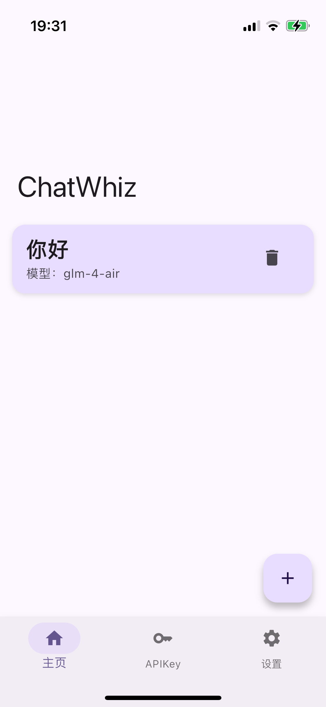
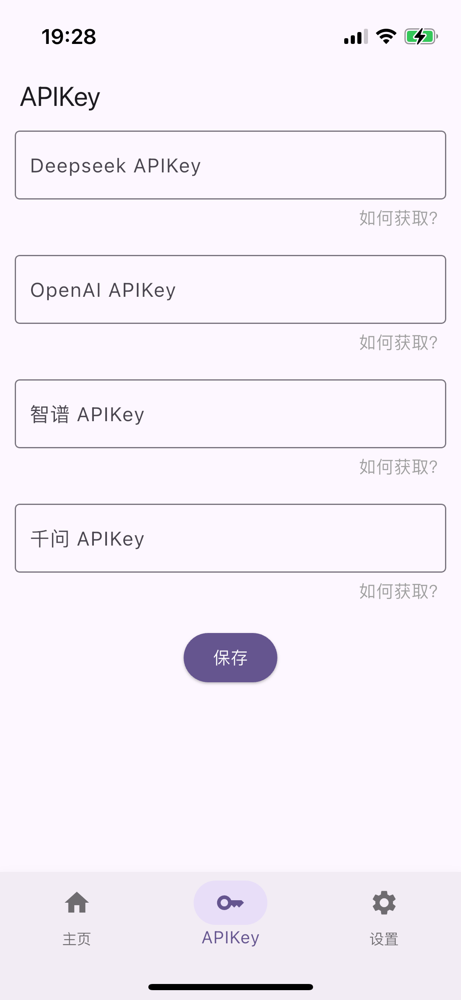
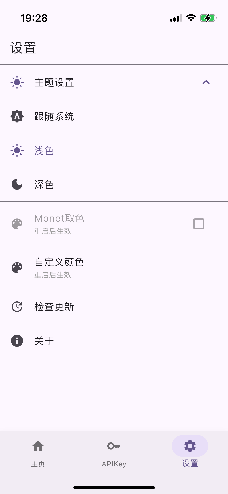
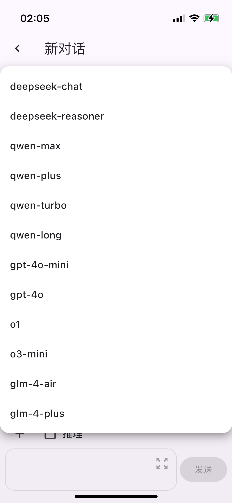
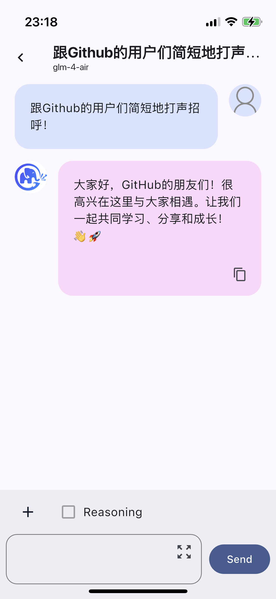
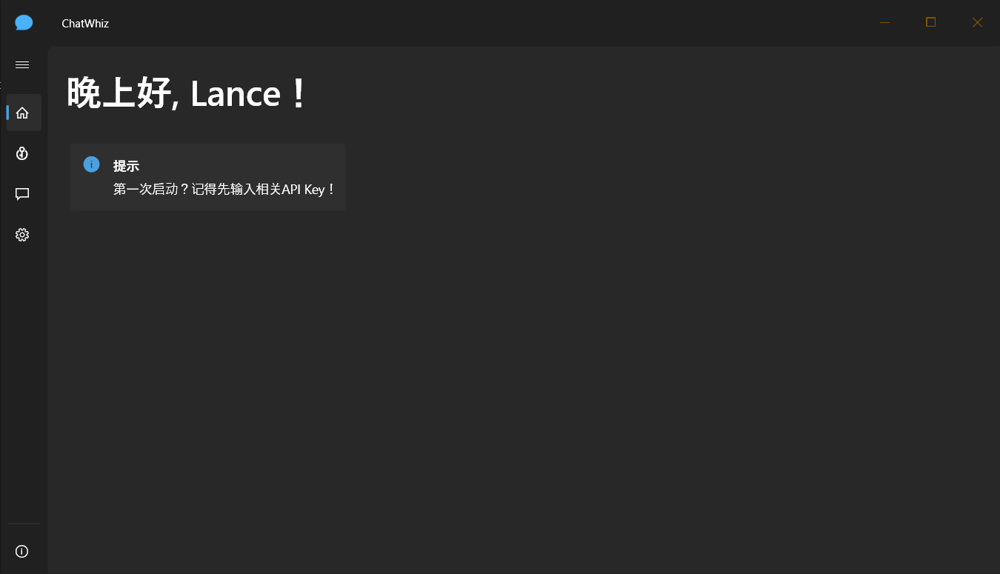
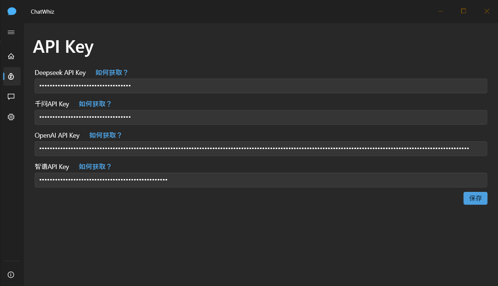
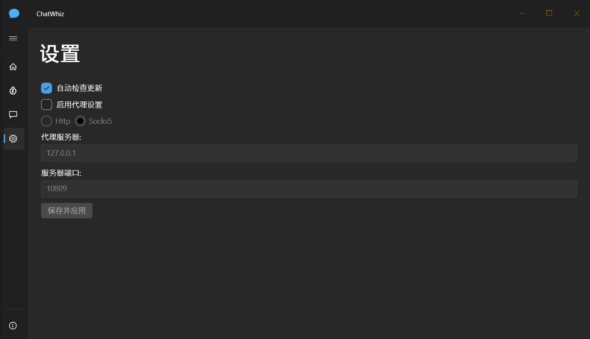
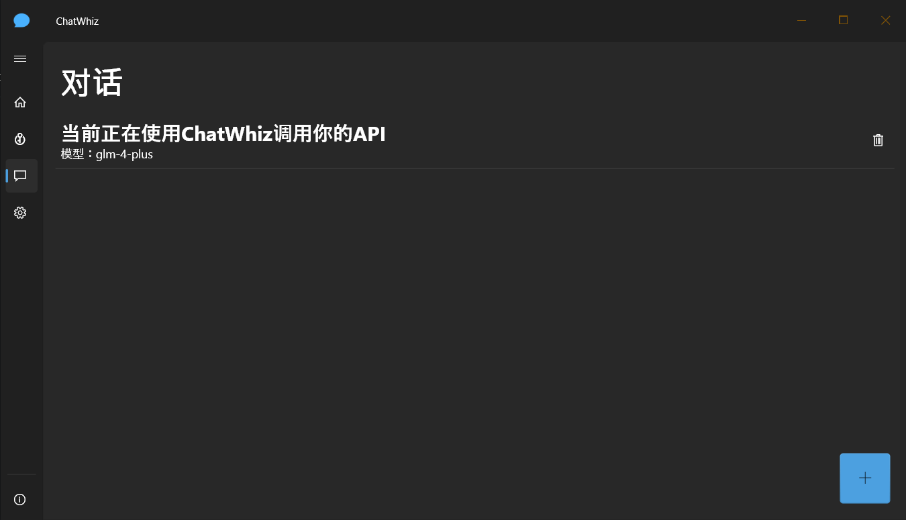
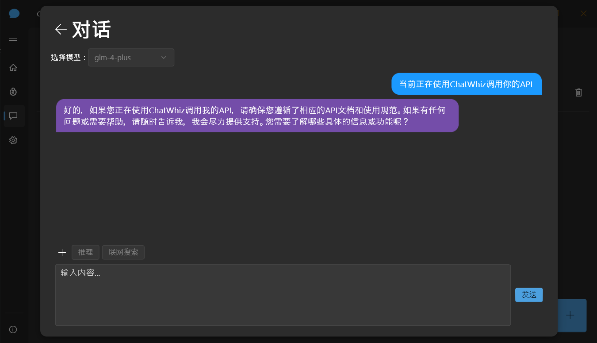

English | [简体中文](README_CN.md)
# ChatWhiz
Switch between OpenAI, Deepseek and other AI models at any time, and locally store API Key and dialog content to provide a seamless and secure dialog experience.

## Features
- Support OpenAI, Deepseek and other AI models (more to come)
- Local storage of API Key and dialog content to ensure data security
- Custom primary color (Only available on mobile)

## Screenshots
### Mobile
<table>
  <tr>
    <td></td>
    <td></td>
    <td></td>
    <td></td>
    <td></td>
  </tr>
</table>

### Desktop
<table>
  <tr>
    <td></td>
    <td></td>
    <td></td>
    <td></td>
    <td></td>
  </tr>
</table>

## License
[MIT](LICENSE) © Linxing Huang