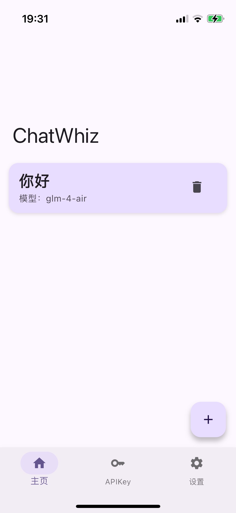
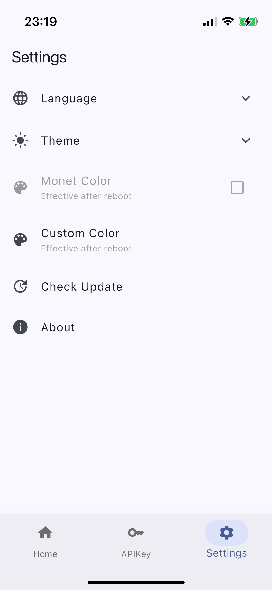

[English](README.md) | 简体中文

# ChatWhiz

随时切换 OpenAI、Deepseek 等 AI 模型，本地存储 API Key 与对话内容，提供无缝且安全的对话体验。

## 通知
当前应用仍在开发阶段。若出现问题请随时提交 Issue 或 Pull Request。

## 特性

- 支持 OpenAI、Deepseek、ChatGLM 等 AI 模型（将陆续增加）
- 本地存储 API Key 与对话内容，确保数据安全
- 自定义颜色（仅限移动端）
- Markdown 语法渲染

## 截图

### 移动端

<table>
  <tr>
    <td></td>
    <td></td>
    <td></td>
    <td></td>
    <td></td>
  </tr>
</table>

## 许可证

[MIT](LICENSE) © Linxing Huang
